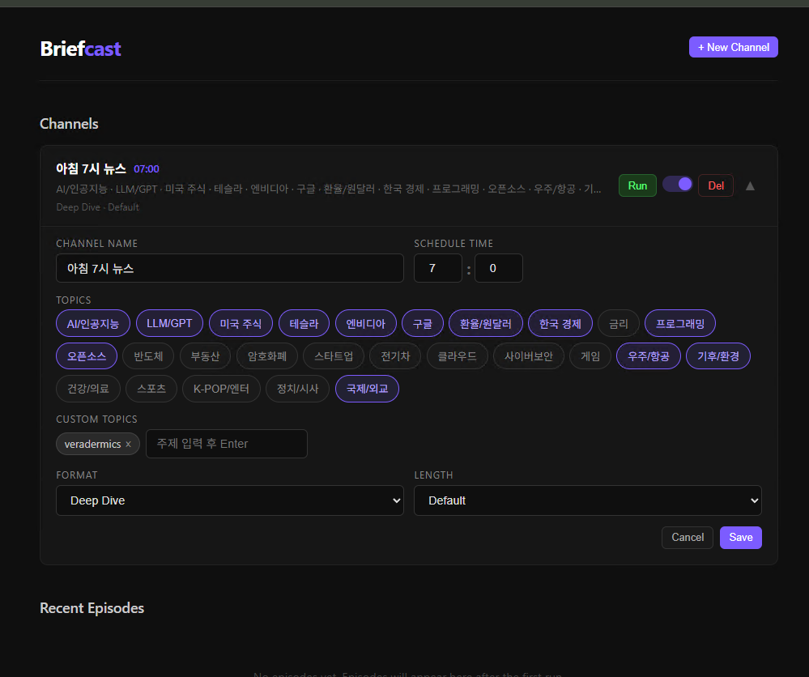

# Briefcast

매일 아침, 원하는 주제로 한국어 AI 팟캐스트를 자동 생성하는 서버.

Google News, DuckDuckGo에서 최근 24시간 뉴스를 수집하고, NotebookLM으로 한국어 팟캐스트 오디오를 생성하여 Google Drive에 저장한다.

## 스크린샷


> 채널 관리 · 26종 주제 토글 · 스케줄 설정 · 커스텀 토픽 · 포맷/길이 선택

---


## 기능

- **채널 기반 관리** — 채널별 독립 스케줄, 주제 조합, 오디오 설정
- **주제 토글 선택** — 26종 미리 정의된 주제를 토글 버튼으로 선택 + 커스텀 주제 추가
- **한/영 자동 검색** — 각 주제마다 한국어+영어 뉴스 자동 수집
- **다중 소스 수집** — Google News RSS, DuckDuckGo 뉴스
- **한국어 팟캐스트** — NotebookLM Audio Overview (Deep Dive, Brief, Critique, Debate)
- **Google Drive 자동 업로드** — 날짜별 폴더 자동 생성
- **수동 실행** — 대시보드에서 Run 버튼으로 즉시 실행
- **복수 채널** — 채널 여러 개 = 하루에 여러 팟캐스트 생성

## 파이프라인

```
[채널별 설정 시간] 스케줄러
    │
    ├─ 1. 주제별 뉴스 수집 (최근 24시간, ko+en 자동)
    │   ├─ Google News RSS (googlenewsdecoder로 URL 변환)
    │   └─ DuckDuckGo 뉴스 검색
    │
    ├─ 2. 본문 추출 (trafilatura) + 상위 10건 선별
    │
    ├─ 3. NotebookLM 오디오 생성 (한국어, 유쾌한 톤)
    │
    └─ 4. Google Drive 업로드
```

## 미리 정의된 주제 (26종)

| 분류 | 주제 |
|------|------|
| 사용자 맞춤 | AI/인공지능, LLM/GPT, 미국 주식, 테슬라, 엔비디아, 구글, 환율/원달러, 한국 경제, 금리, 프로그래밍, 오픈소스, 반도체 |
| 대표 카테고리 | 부동산, 암호화폐, 스타트업, 전기차, 클라우드, 사이버보안, 게임, 우주/항공, 기후/환경, 건강/의료, 스포츠, K-POP/엔터, 정치/시사, 국제/외교 |

각 주제는 한국어 + 영어 검색어가 내장되어 있어 자동으로 양쪽 뉴스를 수집한다. 커스텀 주제도 추가 가능.

## 오디오 설정

| 포맷 | 설명 |
|------|------|
| **DEEP_DIVE** | 심층 분석 (기본값) |
| **BRIEF** | 간략 요약 |
| **CRITIQUE** | 비판적 분석 |
| **DEBATE** | 토론 형식 |

| 길이 | 예상 시간 |
|------|-----------|
| **SHORT** | 5~10분 |
| **DEFAULT** | 10~20분 |
| **LONG** | 20~30분 |

## 기술 스택

| 구성 | 기술 |
|------|------|
| 웹 서버 | FastAPI + Jinja2 |
| 뉴스 수집 | feedparser, trafilatura, duckduckgo-search, googlenewsdecoder |
| 팟캐스트 | notebooklm-py (비공식) |
| 저장소 | Google Drive API |
| DB | SQLite (aiosqlite) |
| 스케줄러 | APScheduler |

## 사전 준비

### 1. NotebookLM 인증

notebooklm-py는 비공식 라이브러리로, 브라우저 쿠키 기반 인증을 사용한다.

```bash
pip install "notebooklm-py[browser]"
playwright install chromium
notebooklm login
```

- 브라우저가 열리면 Google 계정으로 로그인 → NotebookLM 홈페이지 로드 후 Enter
- 쿠키는 `~/.notebooklm/storage_state.json`에 저장됨
- **수 주마다 만료** — 만료 시 `notebooklm login` 재실행

### 2. Google Drive OAuth

1. [Google Cloud Console](https://console.cloud.google.com/) 접속
2. 프로젝트 생성 (또는 기존 프로젝트 사용)
3. **APIs & Services > Library** → "Google Drive API" 검색 → **Enable**
4. **APIs & Services > Credentials** → **Create Credentials > OAuth client ID**
   - Application type: **Desktop app**
5. JSON 다운로드 → 프로젝트 루트에 `credentials.json`으로 저장
6. **OAuth consent screen** 설정:
   - User type: External (테스트 중 상태 OK)
   - Test users: 본인 Gmail 추가

첫 실행 시 브라우저가 열리며 권한 승인 → `token.json` 자동 생성.

### 3. Google Drive 폴더

1. Google Drive에서 폴더 생성 (예: `Briefcast`) — **비공개 유지**
2. 폴더 URL에서 ID 복사: `https://drive.google.com/drive/folders/{FOLDER_ID}`
3. `.env`에 `GOOGLE_DRIVE_FOLDER_ID={FOLDER_ID}` 설정

## 설치

```bash
# 가상환경
python -m venv venv
source venv/Scripts/activate  # Windows Git Bash

# 의존성 설치
pip install -r requirements.txt

# 환경변수 설정
cp .env.example .env
# .env 편집하여 GOOGLE_DRIVE_FOLDER_ID 설정
```

## 실행

```bash
python server.py
```

대시보드: http://localhost:8585

Server Manager(`http://localhost:9000`)에 등록되어 있으면 자동 시작됨.

## 설정

### .env (서버 설정)

| 변수 | 기본값 | 설명 |
|------|--------|------|
| `HOST` | `0.0.0.0` | 서버 바인드 주소 |
| `PORT` | `8585` | 서버 포트 |
| `GOOGLE_DRIVE_FOLDER_ID` | (필수) | Drive 업로드 대상 폴더 ID |
| `MAX_ARTICLES_PER_TOPIC` | `10` | 주제당 최대 수집 기사 수 |
| `ARTICLE_FETCH_DELAY` | `1.5` | 기사 수집 간 딜레이 (초) |

## 구조

```
briefcast/
├── server.py              ← FastAPI 서버 + 대시보드 + Channels API
├── core/
│   ├── collector.py       ← 주제별 ko/en 뉴스 수집 + 본문 추출
│   ├── podcast.py         ← NotebookLM 한국어 오디오 생성
│   ├── drive.py           ← Google Drive 업로드
│   ├── database.py        ← SQLite DB (channels, episodes)
│   └── scheduler.py       ← APScheduler + 채널별 파이프라인
├── templates/
│   └── dashboard.html     ← 대시보드 UI (채널 관리 + 주제 토글 + 히스토리)
├── data/                  ← SQLite DB (gitignored)
├── output/                ← MP3 임시 저장 (gitignored)
├── credentials.json       ← Google OAuth (gitignored)
├── token.json             ← OAuth 토큰 (gitignored, 자동 생성)
├── .env                   ← 환경변수 (gitignored)
├── .env.example
└── requirements.txt
```

## 주의사항

- **notebooklm-py는 비공식 라이브러리**. Google이 내부 API를 변경하면 작동이 중단될 수 있음.
- 쿠키는 **수 주마다 만료**됨. 서버 로그에 인증 에러가 나면 `notebooklm login` 재실행.
- 무료 계정 기준 일일 오디오 생성 횟수에 제한이 있을 수 있음 (비공식이라 정확한 수치 미공개).
- `credentials.json`, `token.json`, `.env`는 gitignored — 새 환경에서는 재설정 필요.
